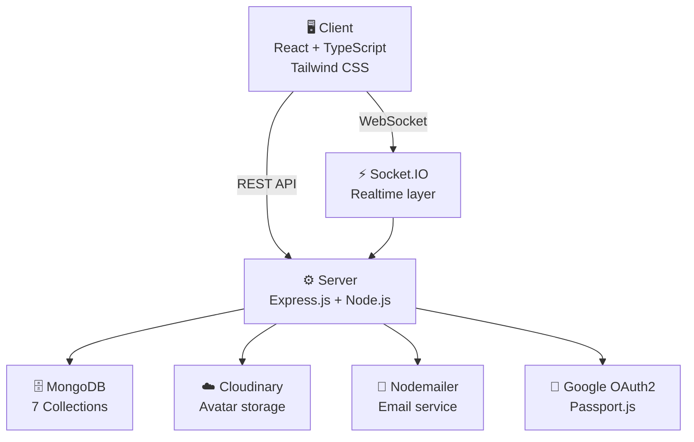
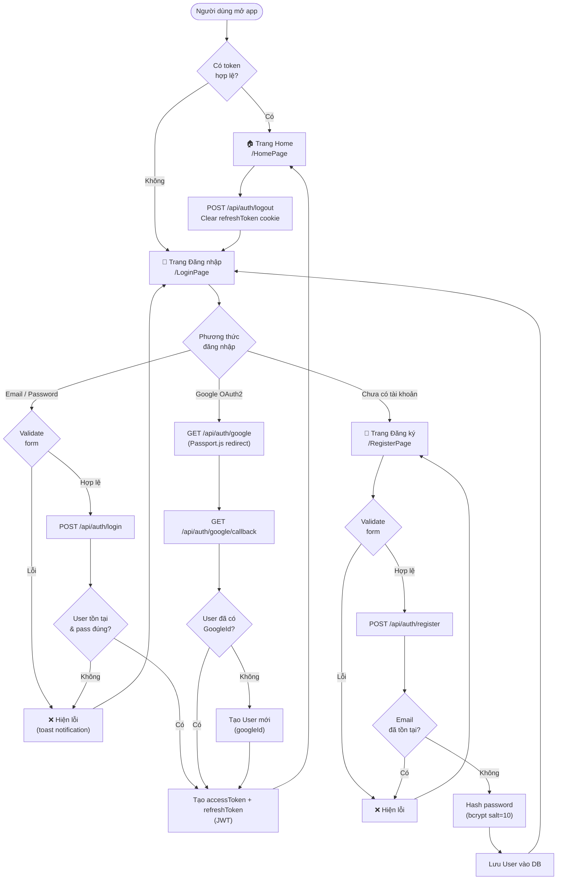
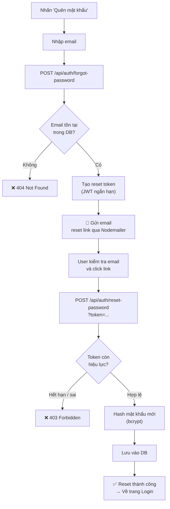
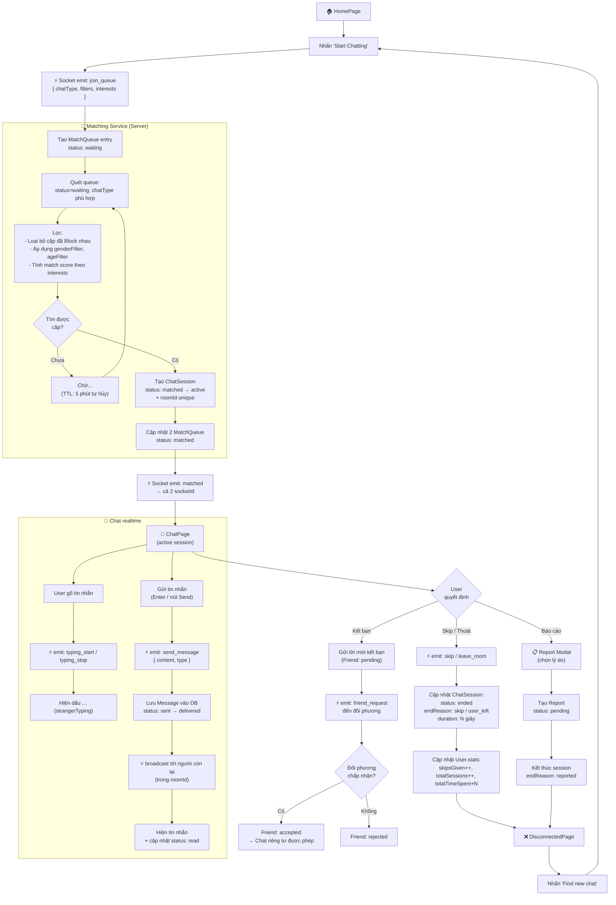
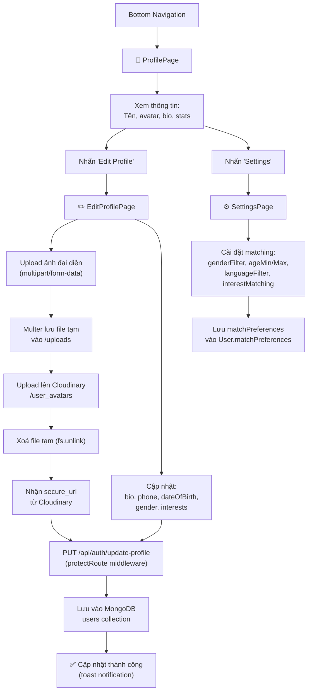
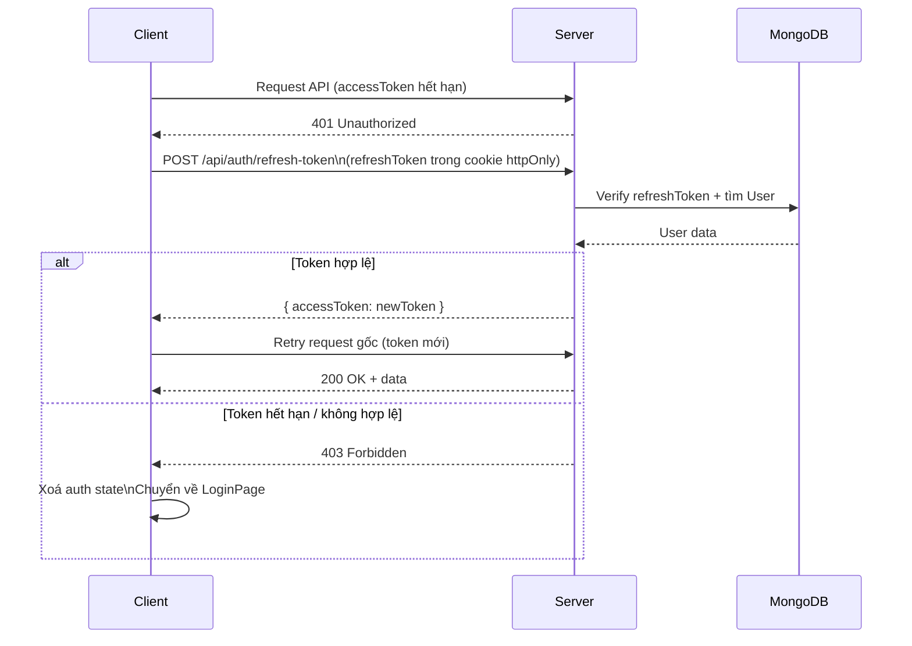
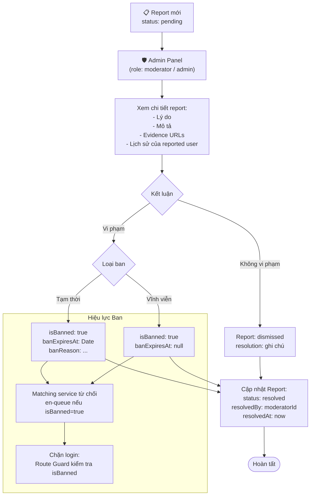
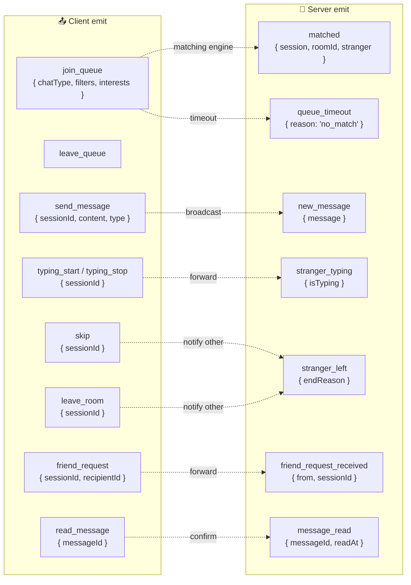
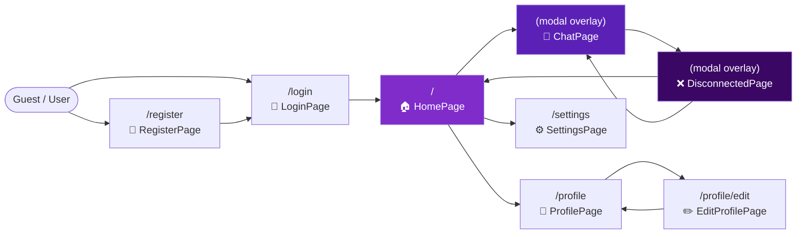
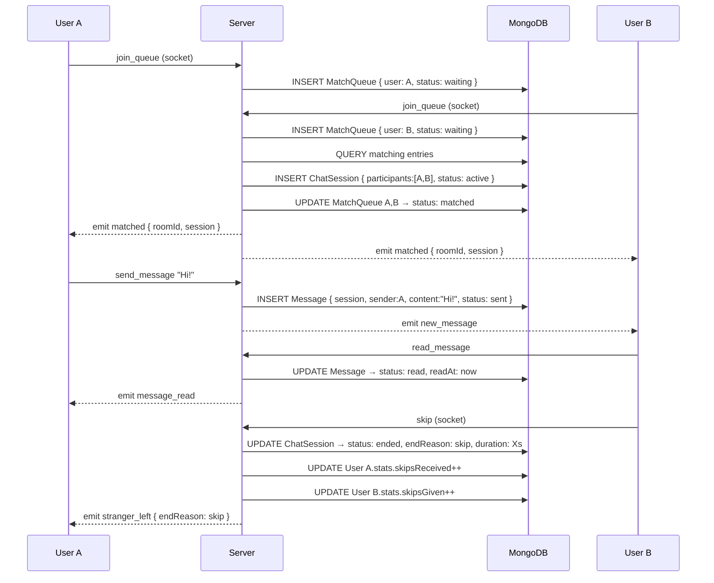

# 🗺️ VibeTalk — Application Flowchart

> Toàn bộ luồng hoạt động của ứng dụng chat ngẫu nhiên VibeTalk

---

## 1. Tổng quan kiến trúc

---

## 2. Luồng xác thực (Authentication)

---

## 3. Luồng quên mật khẩu (Password Reset)

---

## 4. Luồng Random Chat (Core Feature)

---

## 5. Luồng quản lý Profile

---

## 6. Luồng Token Refresh

---

## 7. Luồng Moderation (Admin / Moderator)

---

## 8. Socket.IO Event Map

---

## 9. Page Navigation Map

---

## 10. Database Write Sequence (1 phiên chat đầy đủ)

